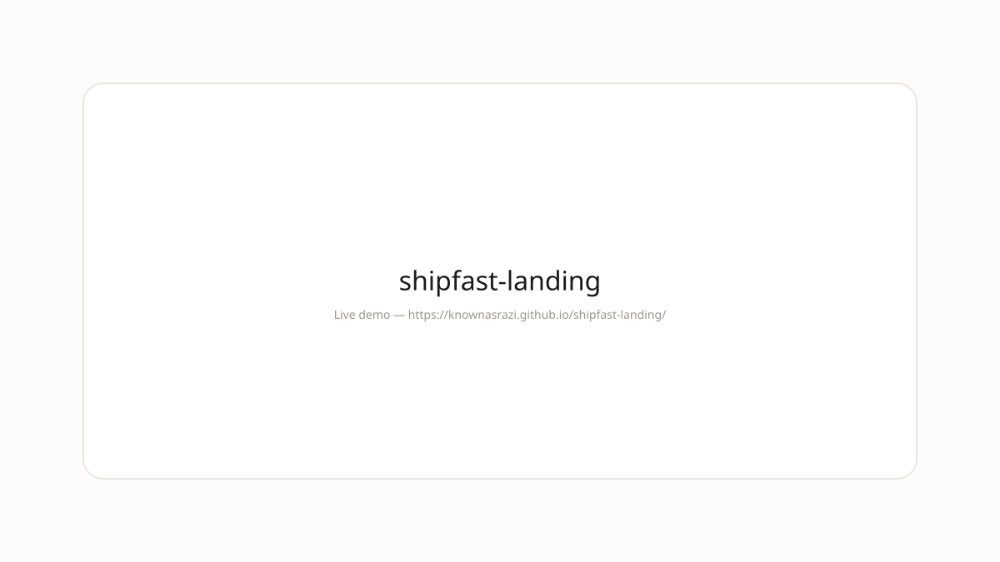

>   

---
## Demo



**Live:** https://knownasrazi.github.io/shipfast-landing/

> Screenshot is a placeholder — Pages deploys on push to `main`.

---


<div align="center">

# shipfast-landing

**Ship your landing in an afternoon.**

High-converting landing page template - clean aesthetic, Tailwind, and motion.

</div>

---

## Features

| Feature | Detail |
|---------|--------|
| **Speed** | Local-first, no upload |
| **Taste** | Clean aesthetic, stone and ink |
| **Stack** | Next.js + Tailwind |
| **For** | Vibe coders and web developers |

## Why shipfast-landing?

Web tools should feel like paper. This one does.

- **Private by default** — runs in your browser or on your machine
- **No lock-in** — export HTML, JSON, or Markdown
- **Clean** — low contrast, high taste

## Usage

```bash
git clone https://github.com/knownasrazi/shipfast-landing.git
cd shipfast-landing
bun run dev
```

## License

[MIT](./LICENSE)
